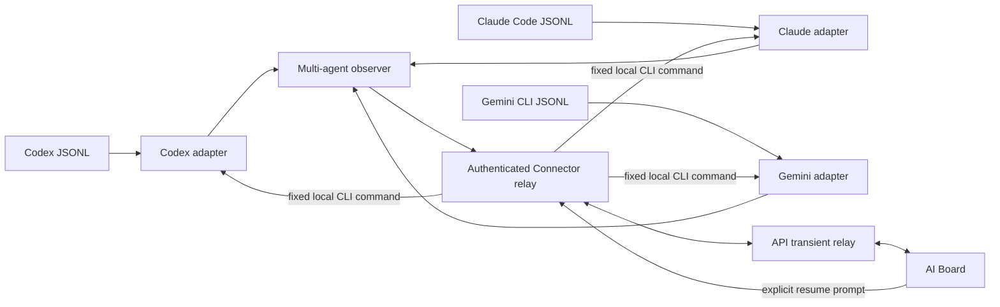

# 多 Agent 会话观察与续聊方案

## 目标

将 AgentBoard 从仅观察 Codex 扩展为同一台已配对设备上的多 Agent 实时看板。首批支持 Codex、Claude Code 和 Gemini CLI；服务端继续只做经过认证的易失中继，不保存 session、消息、工具参数、输出或本地文件路径。

会话继续使用统一的 `observe.*` WebSocket 协议。每条 `ObservedSession` 增加必填 `agent` 字段，取值为 `codex`、`claude_code` 或 `gemini_cli`。看板中的 `session_id` 是 Connector 生成的 `<agent>:<native-id>` 不透明标识；原生 ID 不会离开 Connector，避免工具间 ID 碰撞，也避免浏览器把它当作可执行参数。

## 首批适配矩阵

| Agent | 本机观察源 | 状态归纳 | 对空闲会话追加命令 |
| --- | --- | --- | --- |
| Codex | `CODEX_HOME/sessions/**/*.jsonl` | 生命周期与工具调用可观察 | `codex exec resume --skip-git-repo-check <native-id> <prompt>` |
| Claude Code | `AGENTBOARD_CLAUDE_HOME/projects/**/*.jsonl`，默认 `~/.claude/projects` | 用户消息、助手消息与工具调用 | `claude --resume <native-id> --print <prompt>` |
| Gemini CLI | `AGENTBOARD_GEMINI_HOME/tmp/**/chats/*.jsonl`，默认 `~/.gemini/tmp` | 用户/模型消息；部分运行态仅能推断 | `gemini --resume <native-id> --prompt <prompt>` |

Gemini CLI 的本地 `projects.json` 仅在 Connector 内读取，用 `projectHash` 反查工作目录，以便在对应项目中恢复会话。若映射缺失，仍可观察会话，但不会显示“继续原会话”。

## Connector 架构



每个适配器只负责发现、tail JSONL、白名单归纳状态和按需读取详情。`multiobserver` 负责投影为全局 session ID、转发快照/增量，并把恢复请求路由回正确适配器。认证、用户-设备授权、请求幂等、取消受管进程和 WebSocket 中继保持共用。

## 命令追加语义

“继续原会话”只允许 `idle`、`completed`、`aborted` 或 `unknown` 且具有工作目录的 session；`active` session 永远拒绝，避免与用户正在使用的终端竞争输入。

浏览器中的确认输入是一次显式续聊 prompt。Connector 根据 `agent` 固定构造二进制名与参数，不接受浏览器传入的 binary、额外 flag、Shell 片段或工作目录。启动后的进程由 Connector 管理，可取消；当前三个 CLI 均以单次非交互恢复执行，因此受管能力只报告 `cancel`，不承诺对运行中原始会话附着 stdin。

## 隐私与降级

- 快照和增量只包含 agent、状态、cwd、标题、活动时间、工具名和受管 PID 等最小字段。
- 标题永不从首条 prompt 或助手内容生成；工具调用不上传参数。
- 详情只在设备所有者主动点击后临时读取，Claude 工具调用详情只显示工具名和 “Tool invocation”，不显示输入参数。
- JSONL 结构无法识别、文件短写或本机目录不存在时，适配器不会使 Connector 停止。不可判定状态降级为 `unknown` 或 `inferred`。
- Agent CLI 未安装、认证失效或原生 session 已被清理时，恢复操作返回受限错误，不执行任何替代命令。

## 配置与发布

无需配置即可使用三个默认目录。非默认目录或包装器二进制可通过 Connector 进程环境指定：

```text
CODEX_HOME=<codex-home>
AGENTBOARD_CLAUDE_HOME=<claude-home>
AGENTBOARD_GEMINI_HOME=<gemini-home>
AGENTBOARD_CODEX_BIN=<codex-binary>
AGENTBOARD_CLAUDE_BIN=<claude-binary>
AGENTBOARD_GEMINI_BIN=<gemini-binary>
```

运行 `ai-connector doctor --json` 或 `ai-connector observe status` 可查看三个根目录和当前聚合 session。协议新增必填 `agent` 字段，因此升级 API 后必须同时升级 Connector；旧 Connector 的仅 Codex 观察包会被严格协议校验拒绝，而不会被错误归类成未知 Agent。

后续扩展只需新增一个本地 adapter，并实现 JSONL/公开 API 的发现、最小 reducer、按需 detail parser 和固定 `resume` 命令映射；不得扩展浏览器到 Connector 的任意命令执行能力。
