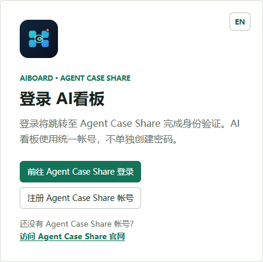
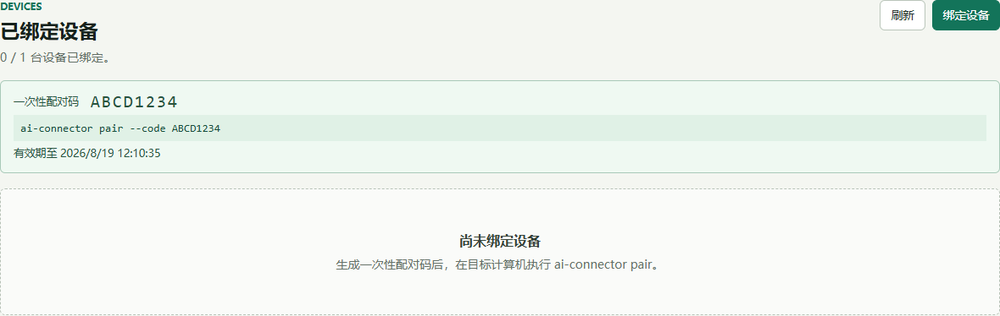
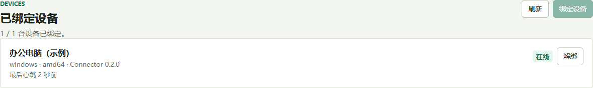
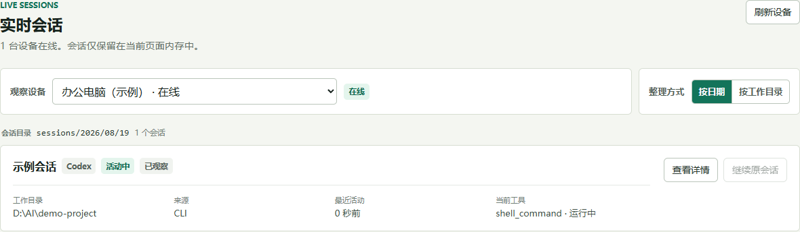

# 用 AI Connector 在其他设备监控 Codex、Claude Code 和 Gemini CLI

如果 Codex、Claude Code 或 Gemini CLI 运行在一台电脑上，而你希望在手机、平板或另一台电脑上查看它们的运行状态，可以使用 [AI Connector](https://github.com/parkerluxu/ai-connector) 配合 [AgentBoard 看板](https://aiboard.agentcaseshare.cn/)。

这套方案的核心特点是：**AI 任务仍然在原电脑本地运行，浏览器只是查看经过筛选的状态；服务器不会保存配对设备上的会话原文、推理内容、本地文件或工具输入输出等具体使用信息。** Connector 只建立从原电脑到 AgentBoard 的出站连接，通常不需要给原电脑开放公网端口。

本文以“AI 工具运行在 Windows/Linux/macOS 的电脑 A，使用手机或电脑 B 监控”为例，完整介绍安装、配对、启动、看板使用、工作原理和隐私边界。

> **最重要的隐私结论：**服务器不会保存任何配对设备上的具体使用内容。会话原文、提示词、推理、本地文件、工具参数和工具输出不会作为历史记录写入服务器；服务器只处理账号/设备绑定和实时中继所需的最小控制面数据。

## 一、先理解最终效果

完成配置后，数据流大致如下：

```text
电脑 A：Codex / Claude Code / Gemini CLI
          │ 本地会话日志
          ▼
电脑 A：ai-connector
          │ 出站 HTTPS/WSS，加密、认证、最小字段
          ▼
AgentBoard：实时中继（不保存会话历史）
          │ 当前连接转发
          ▼
电脑 B：浏览器中的 AgentBoard 看板
```

你可以在电脑 B 上看到：

- 哪些会话正在运行、空闲、已完成或已中止；
- 会话属于 Codex、Claude Code 还是 Gemini CLI；
- 工作目录、会话来源、最近活动时间和当前工具状态；
- 设备在线状态、系统、架构、Connector 版本和最后心跳；
- 在明确点击“查看详情”后，临时查看受限的会话消息和工具事件；
- 对允许继续的已结束会话提交一条新提示，让电脑 A 在本地继续执行。

电脑 B 不会直接访问电脑 A 的文件系统，也不会获得一个可以执行任意命令的远程终端。

## 二、准备工作

### 1. 电脑 A：安装 AI 工具和 Connector

电脑 A 需要已经安装并能正常使用至少一个 CLI：

| Agent | 默认本地会话目录 | 继续会话命令 |
| --- | --- | --- |
| Codex | `CODEX_HOME/sessions`，未设置时通常为 `~/.codex/sessions` | `codex exec resume --skip-git-repo-check <session-id> <prompt>` |
| Claude Code | `~/.claude/projects`，可用 `AGENTBOARD_CLAUDE_HOME` 覆盖 | `claude --resume <session-id> --print <prompt>` |
| Gemini CLI | `~/.gemini/tmp`，可用 `AGENTBOARD_GEMINI_HOME` 覆盖 | `gemini --resume <session-id> --prompt <prompt>` |

从 [GitHub Releases](https://github.com/parkerluxu/ai-connector/releases) 下载与系统和 CPU 架构匹配的 Connector：

| 系统 | 文件示例 |
| --- | --- |
| Windows x64 | `ai-connector_<version>_windows_amd64.exe` |
| Windows ARM64 | `ai-connector_<version>_windows_arm64.exe` |
| Linux x64 | `ai-connector_<version>_linux_amd64` |
| Linux ARM64 | `ai-connector_<version>_linux_arm64` |

Windows 直接运行 `.exe`。Linux 下载后执行：

```bash
chmod +x ai-connector_<version>_linux_<arch>
```

macOS 当前没有 Release 预编译文件，可以使用 Go 1.24 或更高版本从源码构建：

```bash
go build ./cmd/ai-connector
```

建议先检查版本和网络健康状态：

```powershell
.\ai-connector.exe version
.\ai-connector.exe doctor
```

Linux/macOS 将命令中的 `.\ai-connector.exe` 换成 `./ai-connector`。

### 2. 电脑 B：准备浏览器

电脑 B 不需要安装 Connector，只要能打开 [https://aiboard.agentcaseshare.cn/](https://aiboard.agentcaseshare.cn/) 并访问互联网即可。手机、平板、办公电脑都可以作为监控端。



图 1：未登录时的 AgentBoard 入口。点击“前往 Agent Case Share 登录”或注册统一账号；截图中的页面不包含任何真实账号信息。

### 非默认目录或 CLI 路径

如果某个 Agent 使用了非默认目录，或 CLI 不在系统 `PATH` 中，可以在启动 Connector 前设置环境变量。Windows PowerShell 示例：

```powershell
$env:CODEX_HOME = "D:\AI\codex"
$env:AGENTBOARD_CLAUDE_HOME = "D:\AI\claude"
$env:AGENTBOARD_GEMINI_HOME = "D:\AI\gemini"
$env:AGENTBOARD_CODEX_BIN = "C:\Tools\codex.cmd"
$env:AGENTBOARD_CLAUDE_BIN = "C:\Tools\claude.cmd"
$env:AGENTBOARD_GEMINI_BIN = "C:\Tools\gemini.cmd"
.\ai-connector.exe observe serve
```

Linux/macOS 使用 `export CODEX_HOME=...`、`export AGENTBOARD_CLAUDE_HOME=...` 等方式设置。若使用后台服务，请把这些变量配置到服务启动环境中，而不是只在某个临时终端中设置。

## 三、登录 AgentBoard 并生成一次性配对码

1. 在电脑 B 的浏览器打开 [AgentBoard](https://aiboard.agentcaseshare.cn/)。
2. 使用 Agent Case Share 账号登录；没有账号时先注册。
3. 进入“设备”页面，点击“绑定设备”。
4. 页面会显示一次性配对码以及类似下面的命令：

   ```text
   ai-connector pair --code ABCD1234
   ```



图 2：设备页生成配对码后的局部界面。图中的 `ABCD1234` 是仅用于说明页面布局的示例码，实际操作时必须使用页面现场生成的配对码。

配对码默认只有 **10 分钟**有效，成功认领后立即失效。它相当于“首次绑定邀请”，不是长期密码。不要把它发到公开群聊、工单、截图或脚本仓库中。

账号默认最多绑定一台设备。如果要换电脑，先在设备页面解绑旧设备，再生成新配对码。解绑会使旧凭据失效并断开现有连接。

## 四、在电脑 A 完成配对

### 推荐方式：交互式输入

在电脑 A 打开终端，切换到 Connector 所在目录，执行：

```powershell
.\ai-connector.exe pair
```

程序会提示 `Enter the one-time pairing code:`。粘贴电脑 B 页面显示的配对码并回车。交互式输入不会把配对码直接写进命令历史。

也可以显式传参：

```powershell
.\ai-connector.exe pair --code "ABCD1234"
```

Linux/macOS：

```bash
./ai-connector pair --code "ABCD1234"
```

成功后会看到设备和凭据已绑定的提示。Connector 会在本机生成随机 `device_id`、`credential_id` 和 Ed25519 密钥对，并只把公钥提交给 AgentBoard。Agent Case Share 的登录密码不会传给 Connector，也不会被写入 Connector 配置。

### 配置文件和私钥位置

默认配置文件位置如下：

| 系统 | 路径 |
| --- | --- |
| Windows | `%APPDATA%\\AgentBoard\\connector.json` |
| Linux | `~/.config/AgentBoard/connector.json` |
| macOS | `~/Library/Application Support/AgentBoard/connector.json` |

Windows 使用系统 DPAPI 保护私钥；Unix 系统将配置文件以 `0600` 权限保存。不要复制、提交或公开这个文件。换电脑时重新配对，不要复制旧设备私钥来迁移身份。

## 五、启动本地观察服务

先在电脑 A 启动一次 Codex、Claude Code 或 Gemini CLI，确保它们已经产生本地会话记录。然后运行：

```powershell
.\ai-connector.exe observe serve
```

这个命令会：

1. 在本机扫描三个 Agent 的会话目录；
2. 读取新增或变化的 JSONL 行并归纳状态；
3. 连接 `wss://aiboard.agentcaseshare.cn/v1/connectors/ws`；
4. 完成设备挑战签名和认证；
5. 等待看板订阅后发送快照和增量更新。

首次验证可以保持终端前台运行。另开一个终端检查本机发现的会话：

```powershell
.\ai-connector.exe observe status
```

查看配对状态和目录：

```powershell
.\ai-connector.exe status
```

当电脑 B 的设备页面显示“在线”后，进入“实时会话”，选择目标设备即可查看状态。

设备绑定成功后，设备页会显示设备名称、系统架构、Connector 版本、在线状态和最后心跳。例如：



图 3：已绑定设备列表的局部界面。图中设备名和时间均为示例数据；真实页面会显示你在配对时设置的设备信息。

### 设置为后台服务

需要长期监控时，可安装当前用户级服务：

```powershell
.\ai-connector.exe service install
.\ai-connector.exe service start
.\ai-connector.exe service status
```

Linux 使用同样的子命令：

```bash
./ai-connector service install
./ai-connector service start
./ai-connector service status
```

服务只会执行固定的 `observe serve`，不会接受来自浏览器的任意 Shell 命令或额外参数。停止或移除：

```text
ai-connector service stop
ai-connector service uninstall
```

## 六、在电脑 B 上使用看板

### 实时状态

实时会话页展示的是状态投影，不是完整聊天记录。你可以按 Agent 和状态筛选，快速判断哪个任务仍在工作、哪个任务已经结束，以及当前是否正在调用工具。



图 4：实时会话页的局部界面。示例中可以看到设备在线、会话所属 Agent、当前状态、工作目录、来源、最近活动和当前工具。

会话的公共 `session_id` 是 Connector 根据 Agent 和本地原生 ID 生成的不透明哈希投影，不直接暴露原生 ID。原生 ID 只留在电脑 A，用于本地继续命令，因此 Codex、Claude Code 和 Gemini CLI 之间不会因为 ID 相同而串会话。

### 查看详情

只有在设备所有者在看板中主动点击“查看详情”时，Connector 才会从电脑 A 读取对应本地 JSONL 的受限内容，并通过当前已认证的实时连接返回当前浏览器。详情有数量和总字符数上限，页面关闭后不会作为历史记录保留。

详情不是默认上传，也不等于开放整个日志目录。Claude Code 的工具调用详情只显示工具名称和“Tool invocation”，不会显示工具输入参数；默认状态也不会上传推理内容、原始 JSONL 行或本地文件内容。

### 继续原会话

对状态为 `idle`、`completed`、`aborted` 或 `unknown` 且具有工作目录的会话，可以点击“继续原会话”并输入新的提示。Connector 会根据 Agent 固定构造本地命令：

```text
Codex        -> codex exec resume --skip-git-repo-check <本地 ID> <提示>
Claude Code  -> claude --resume <本地 ID> --print <提示>
Gemini CLI   -> gemini --resume <本地 ID> --prompt <提示>
```

浏览器不能指定任意二进制文件、工作目录、Shell 片段或额外参数。正在运行的 `active` 会话不会被强行注入输入，避免和电脑 A 上用户正在操作的终端争抢会话。受管进程当前支持取消，取消只作用于 Connector 启动的那一次恢复进程。

## 七、原理：为什么不需要开放端口

### 1. Connector 是本地观察者，不是远程桌面

Connector 运行在电脑 A 上，通过适配器读取本地会话文件：

- Codex 适配器观察 `CODEX_HOME/sessions/**/*.jsonl`；
- Claude Code 适配器观察 `AGENTBOARD_CLAUDE_HOME/projects/**/*.jsonl`；
- Gemini CLI 适配器观察 `AGENTBOARD_GEMINI_HOME/tmp/**/chats/*.jsonl`，并在本机读取 `projects.json` 反查工作目录。

适配器只负责发现、tail 文件、归纳状态和按需解析详情。它不会把日志目录映射成 HTTP 文件服务，也不会监听一个让公网直接连接的本地端口。

### 2. 出站 WebSocket 负责实时传输

电脑 A 主动向 AgentBoard 发起 TLS 加密的 `wss://` 连接。很多网络只允许出站访问，因此不需要配置端口转发或公网 IP。连接建立后，AgentBoard 对设备发起挑战，Connector 用本地 Ed25519 私钥签名；服务器用配对时登记的公钥验证签名。

浏览器 B 通过已登录的 AgentBoard 页面订阅设备。服务器只在这条经过账号和设备授权的实时链路上转发数据。浏览器关闭、Connector 退出或网络断开后，实时状态流就结束。

### 3. 多 Agent 如何合并

三个本地适配器都输出统一的 `ObservedSession` 模型。`multiobserver` 给每个会话附加 `agent` 字段，并用哈希生成公共会话 ID；因此看板可以统一显示 Codex、Claude Code 和 Gemini CLI，同时保留各 CLI 的本地恢复方式。

### 4. 为什么服务端不会保存具体内容

服务器承担的是认证、设备授权和实时中继，而不是日志仓库。默认状态经过字段白名单过滤，只发送设备/会话标识、工作目录、来源、状态、时间戳、工具名称和工具状态等最小字段。实时观察数据只在 API 内存和当前浏览器连接中转发，不作为历史会话写入服务端数据库。

“查看详情”也是一次明确的临时请求：内容从电脑 A 读取后沿当前认证连接返回，并且不写入服务端数据库。服务器不会保存：

- Codex、Claude Code 或 Gemini CLI 的完整会话记录；
- 用户提示词、模型推理内容和原始 JSONL 行；
- 本地文件内容；
- 工具调用参数和工具输出（Claude Code 工具详情只保留名称级展示）；
- 电脑 A 的私钥或一次性配对码。

这里的“不会保存具体信息”指不会保存配对设备上的具体使用内容。为实现设备管理和撤销，系统仍可能保留必要的控制面元数据，例如设备标识、设备名称、系统/架构、凭据状态和在线心跳；这些元数据不是会话内容，也不能反推出本地文件或完整对话。工作目录可能暴露项目名称，因此请只配对你愿意让该 AgentBoard 账号看到其路径元数据的设备。

Connector 自己可能在电脑 A 的本地配置目录创建观察元数据数据库，用于记录文件偏移量、文件指纹、会话关联和受管进程状态，以便重启后继续观察。这些记录只服务于本地增量读取，不包含 JSONL 原文、提示词、推理内容、工具参数、工具输出或本地文件内容。

## 八、安全使用建议

1. 只从可信 Release 或源码构建获取 Connector，并核对版本。
2. 配对码只在电脑 B 和电脑 A 之间短暂传递，过期就重新生成。
3. 不要分享 `connector.json`、私钥、终端历史或包含配对码的截图。
4. AgentBoard 使用强密码并保护浏览器登录态；他人拿到账号会看到该账号已授权的设备状态。
5. 不再使用某台电脑时，先在设备页解绑，再停止并卸载本地服务。
6. 工作目录包含敏感项目名时，先确认自己接受这项元数据可见性。
7. 通过公司代理或 TLS 检查设备时，确认其不会记录 WebSocket 明文内容；Connector 到 AgentBoard 的连接本身使用 TLS。

## 九、常见问题

### 配对码无效或过期

回到设备页重新生成，在 10 分钟内执行 `pair --code`。每个配对码只能成功使用一次。

### 设备一直离线

在电脑 A 执行 `ai-connector service status`，或直接前台运行 `ai-connector observe serve`。再运行 `ai-connector doctor` 检查 API 健康状态。防火墙、公司代理、系统时间错误或 TLS 检查都可能阻止出站 WSS。

### 看不到会话

确认对应 CLI 在电脑 A 的同一用户下运行，并确认会话目录存在。可以运行 `ai-connector doctor --json` 查看 Connector 识别到的三个根目录；非默认目录可通过 `CODEX_HOME`、`AGENTBOARD_CLAUDE_HOME` 或 `AGENTBOARD_GEMINI_HOME` 设置。

### “查看详情”失败

本地日志可能已被删除、正在写入或格式无法识别。此时 Connector 会返回受限错误，不会把文件内容上传到其他位置。

### 继续会话失败

确认对应 CLI 仍安装在电脑 A 的 PATH 中，原生会话仍存在且不是 `active`。也可以设置 `AGENTBOARD_CODEX_BIN`、`AGENTBOARD_CLAUDE_BIN` 或 `AGENTBOARD_GEMINI_BIN` 指向包装器或实际二进制文件。Connector 不会因为恢复失败而执行替代命令。

## 十、停止监控和换机

临时停止：

```powershell
.\ai-connector.exe service stop
```

彻底移除当前用户服务：

```powershell
.\ai-connector.exe service uninstall
```

然后在 AgentBoard“设备”页面解绑设备。换机时，在新电脑安装 Connector、生成新的配对码并重新执行 `pair`；不要复制旧设备的配置文件或私钥。这样旧设备凭据可以被撤销，新设备拥有独立身份。

## 相关链接

- [AgentBoard 看板](https://aiboard.agentcaseshare.cn/)
- [AI Connector 中文 README](../../README.zh-CN.md)
- [多 Agent 观察架构](../architecture/multi-agent-observation.md)
- [隐私说明](../../PRIVACY.md)
- [安全策略](../../SECURITY.md)
